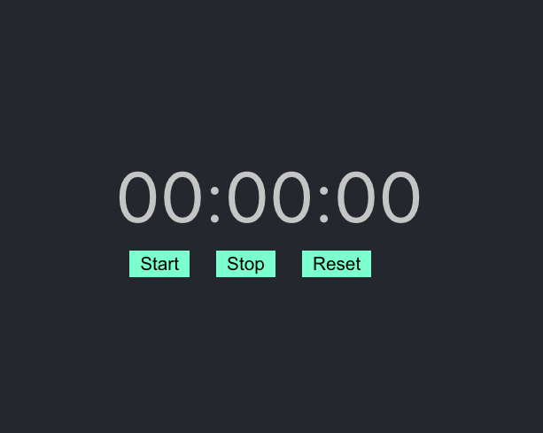

# Getting Started with React-stopwatch app

This project was bootstrapped with [Create React App](https://github.com/facebook/create-react-app).

## Clone the project
In the project directory, you can run:
### `npm install`
### `yarn start`

Runs the app in the development mode.\
Open [http://localhost:3000](http://localhost:3000) to view it in the browser.

